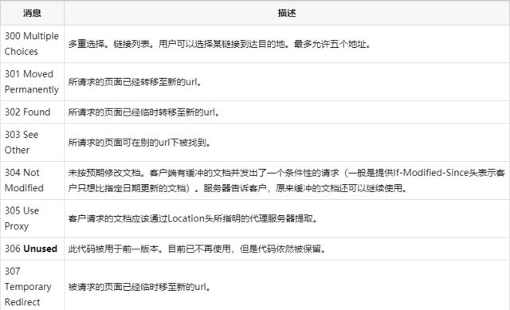
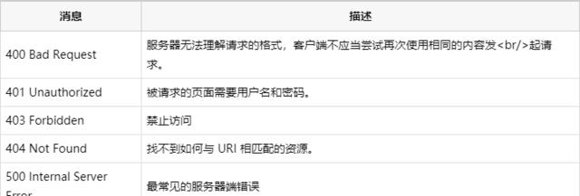
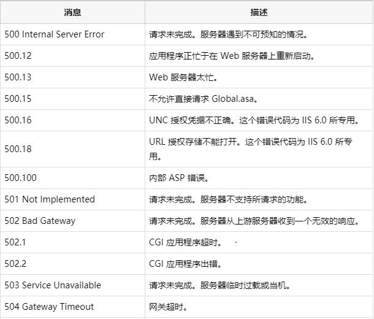

### 练习 6月24
1. js与ts的区别
>TypeScript是JavaScript 的一个超集，增加了静态类型、类、模块、接口和类型注解。在项目中更加容易查找和修复错误，适合多人协作开发，适用于中大型项目。javascript是一种轻量型的解释性脚本语言，人气大，学习曲线不那么复杂，无需特定的语言环境
2. react-router的实现
>待定
3. antd源码
>待定
4. http状态码
>1xx 信息
>200 请求成功
>300 重定向
>400 客户端错误
>500 服务器错
5. 跨域
>nginx反向代理
>node服务器代理
>jsonp跨域
>添加跨域头
>二级域名
6. react-redux
>待定
7. react服务器渲染
>待定
8. DNS加速(seo)
>在前端优化中与 DNS 有关的有两点： 一个是减少DNS的请求次数，另一个就是进行DNS预获取
>1. 用meta信息来告知浏览器, 当前页面要做DNS预解析:`<meta http-equiv="x-dns-prefetch-control" content="on" />`
>2. 在页面header中使用link标签来强制对DNS预解析: `<link rel="dns-prefetch" href="http://bdimg.share.baidu.com" />`
注：dns-prefetch需慎用，多页面重复DNS预解析会增加重复DNS查询次数。
