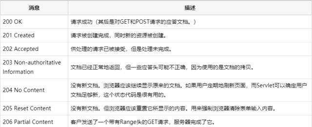

### 练习 6月26下午
1. js实现千分位
```js
    // 方式1
    var toThousands = function(num) {
        return (num || 0).toString().replace(/(\d)(?=(\d{3})+(?!\d))/g, '$1,')
    }
    //方式二
    var toThousands = function(num) {
        return (num || 0).toLocaleString();
    } 
    // 方式三
    var toThousands = function(num) {
        num = (num || 0).toString().split('');
        var len = num.length;
        while(len > 3) {
            len -= 3;
            num.splice(len, 0, ',')
        }
        return num.join('')
    }
```
2. promise实现(`catch`, `then`, `finally`, `all`, `race`, `done`)
3. 网页实现圆内链接点击，圆外不能点击(mouseDown, click, touch事件的区别)
4. `Object.defineProperty`
5. 数据对比`NaN`,`null`,`undefined`
6. html显示更多（不足n行适应显示，超过添加`...`）
7. react-redux（connect方法有哪些参数，有什么作用）
8. react hooks
9. react componentWillMount能不能使用`this.setState`
10. localStorage, sessionStorage, cookies的区别
11. node实现使用数据库
12. 首屏优化

### 练习 6月26晚上
1. 实现队列，栈
2. h5手机屏幕适配(`rem`, `vw`)
3. webpack去除没用代码
4. cdn分发出错
5. js的发挥
6. 雪碧图，svg，base64的优缺点
7. 跨域的实现
8. js实现const的方式
9. 服务器渲染


### 练习 6月24
1. js与ts的区别
>TypeScript是JavaScript 的一个超集，增加了静态类型、类、模块、接口和类型注解。在项目中更加容易查找和修复错误，适合多人协作开发，适用于中大型项目。javascript是一种轻量型的解释性脚本语言，人气大，学习曲线不那么复杂，无需特定的语言环境
2. react-router的实现
>react-router依赖基础 - history
[参考链接](https://blog.csdn.net/tangzhl/article/details/79696055)
[参考链接2](https://blog.csdn.net/weixin_33963189/article/details/88002895)
3. antd源码
>待定
4. http状态码
>1xx 信息<br/>
>200 请求成功<br/>
>300 重定向<br/>
>400 客户端错误<br/>
>500 服务器错<br/>
5. 跨域
>nginx反向代理
>node服务器代理
>jsonp跨域
>添加跨域头
>二级域名
6. react-redux
>待定
7. react服务器渲染
>
webpack 构建一个纯js的react文件，通过node读取获取对应的react类，通过createElement(react类，数据)获取对应的实例，在使用服务器端renderToString()传入实例获取dom对饮的字符串，到此服务器端渲染结束；针对seo，我们还要添加meta数据为了各大搜索引擎的蜘蛛扒取，所以引入了cheerio库，方便我们在服务器端设置dom数据。
针对于同构，我们将服务器获取的数据也放在head里面，方便客户端获取数据
客户端部分，在react组件页面，我们会判断是否为浏览器，如果是的话，我们会从window里面获取到服务器端的数据传入react节点，进行客户端渲染。从而保证服务器端和客户端的数据同步一致。
在做服务器端渲染的，碰到的问题：
1.default
2.数据有部分是商家自己上传的，里面如果存在alert,script等html的语言，会导致客户端解析时报错，为了避免这个错误，我们把<>全部换成对应的html特殊标志。<br/>
渲染一个react节点实例 renderToString(16以下)
renderToNodeStream(16以上)<br/>

<br/>
8. DNS加速(seo)
>在前端优化中与 DNS 有关的有两点： 一个是减少DNS的请求次数，另一个就是进行DNS预获取
>1. 用meta信息来告知浏览器, 当前页面要做DNS预解析:`<meta http-equiv="x-dns-prefetch-control" content="on" />`
>2. 在页面header中使用link标签来强制对DNS预解析: `<link rel="dns-prefetch" href="http://bdimg.share.baidu.com" />`
注：dns-prefetch需慎用，多页面重复DNS预解析会增加重复DNS查询次数。
9. react的新特性
>1、render 支持返回数组和字符串<br/>
>2、新生命周期getDerivedStateFromProps，getSnapshotBeforeUpate<br/>
>3、createPortal，modal传送到任意位置<br/>
>4、新增指针事件<br/>
>5、给函数式组件加memo，实现性能优化<br/>
>6、懒加载组件，lazy, suspense<br/>
>7、react hooks<br/>
[参考链接](https://www.jianshu.com/p/24ed0bc34c12)
10. seo优化
>待定